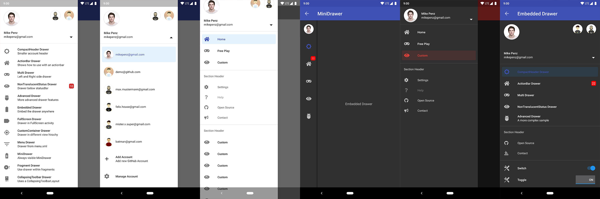

# MaterialDrawer [](https://travis-ci.org/mikepenz/MaterialDrawer) [ ](https://bintray.com/mikepenz/maven/com.mikepenz%3Amaterialdrawer/_latestVersion)

... the flexbile, easy to use, all in one drawer library for your Android project.

-------

<p align="center">
    <a href="#whats-included-">What's included 🚀</a> &bull;
    <a href="#setup">Setup 🛠️</a> &bull;
    <a href="MIGRATION.md">Migration Guide 🧬</a> &bull;
    <a href="FAQ.md">WIKI / FAQ 📖</a> &bull;
    <a href="#used-by">Used by</a> &bull;
    <a href="https://play.google.com/store/apps/details?id=com.mikepenz.materialdrawer.app">Sample App</a>
</p>

-------

### What's included 🚀
- **the easiest possible integration**
- integrate in less than **5 minutes**
- **uses the androidX support libraries**
- compatible down to **API Level 16**
- includes an **AccountSwitcher**
- quick and simple api
- follows the **NEW Google Material Design Guidelines**
- use **vector** (.svg) icons and **icon fonts** via the [Android-Iconics](https://github.com/mikepenz/Android-Iconics) integration
 - **Google Material Design Icons**, Google **Material Community** Design Icons, FontAwesome and more
- comes with various **themes** which help to get your own themes clean
- modify the colors on the go
- comes with multiple default drawer items
- based on a **RecyclerView**
- **RTL** support
- Gmail like **MiniDrawer**
- expandable items
- **badge** support
- define custom drawer items
- tested and **stable**
- sticky footer or headers
- **absolutely NO limits**
- NavController support by @petretiandrea

> If you upgrade from < 8.0.0 follow the [MIGRATION GUIDE](https://github.com/mikepenz/MaterialDrawer/blob/develop/MIGRATION.md)

# Preview

## Screenshots 🎉


# Setup

## Latest releases 🛠

- Kotlin && New | [v8.0.0-rc02](https://github.com/mikepenz/MaterialDrawer/tree/v8.0.0-rc02)
- Kotlin | [v7.0.0](https://github.com/mikepenz/MaterialDrawer/tree/v7.0.0) | (Builder approach like v6.x)
- Java && AndroidX | [v6.1.2](https://github.com/mikepenz/MaterialDrawer/tree/v6.1.2)
- Java && AppCompat | [v6.0.9](https://github.com/mikepenz/MaterialDrawer/tree/v6.0.9)


### 1. Provide the gradle dependency

```gradle
implementation "com.mikepenz:materialdrawer:${lastestMaterialDrawerRelease}"

//required support lib modules
implementation "androidx.appcompat:appcompat:${versions.appcompat}"
implementation "androidx.recyclerview:recyclerview:${versions.recyclerView}"
implementation "androidx.annotation:annotation:${versions.annotation}"
implementation "com.google.android.material:material:${versions.material}"
implementation "androidx.constraintlayout:constraintlayout:${versions.constraintLayout}"

// Add for NavController support
implementation "com.mikepenz:materialdrawer-nav:${lastestMaterialDrawerRelease}"

// Add for Android-Iconics support
implementation "com.mikepenz:materialdrawer-iconics:${lastestMaterialDrawerRelease}"
```

### 2. Add the `Drawer` into the XML

The `MaterialDrawerSliderView` has to be provided as child of the `DrawerLayout` and will as such act as the slider

```kotlin
<androidx.drawerlayout.widget.DrawerLayout xmlns:android="http://schemas.android.com/apk/res/android"
    xmlns:app="http://schemas.android.com/apk/res-auto"
    android:id="@+id/root"
    android:layout_width="match_parent"
    android:layout_height="match_parent"
    android:fitsSystemWindows="true">

    ... your content ...

    <com.mikepenz.materialdrawer.widget.MaterialDrawerSliderView
        android:id="@+id/slider"
        android:layout_width="wrap_content"
        android:layout_height="match_parent"
        android:layout_gravity="start"
        android:fitsSystemWindows="true" />
</androidx.drawerlayout.widget.DrawerLayout>
```
### 3. Add the `DrawerStyle` to your theme

```xml
<style name="SampleApp.DayNight" parent="Theme.MaterialComponents.DayNight.NoActionBar">
    ...
    <item name="materialDrawerStyle">@style/Widget.MaterialDrawerStyle</item>
    <item name="materialDrawerHeaderStyle">@style/Widget.MaterialDrawerHeaderStyle</item>
    ...
</style>
```

Great. Your drawer is now ready to use.

# Additional Setup
### Add items and adding some functionality

```kotlin
//if you want to update the items at a later time it is recommended to keep it in a variable
val item1 = PrimaryDrawerItem().withIdentifier(1).withName(R.string.drawer_item_home)
val item2 = SecondaryDrawerItem().withIdentifier(2).withName(R.string.drawer_item_settings)

// get the reference to the slider and add the items
slider.itemAdapter.add(
	    item1,
	    DividerDrawerItem(),
	    item2,
	    SecondaryDrawerItem().withName(R.string.drawer_item_settings)
)

// specify a click listener
slider.onDrawerItemClickListener = { v, drawerItem, position ->
    // do something with the clicked item :D
    false
}
```

### Selecting an item
```kotlin
//set the selection to the item with the identifier 1
slider.setSelection(1)
//set the selection to the item with the identifier 2
slider.setSelection(item2)
//set the selection and also fire the `onItemClick`-listener
slider.setSelection(1, true)
```

By default, when a drawer item is clicked, it becomes the new selected item. If this isn't the expected behavior,
you can disable it for this item using `withSelectable(false)`:
```kotlin
SecondaryDrawerItem().withName(R.string.drawer_item_dialog).withSelectable(false)
```

### Modify items or the drawer

```kotlin
//modify an item of the drawer
item1.withName("A new name for this drawerItem").withBadge("19").withBadgeStyle(new BadgeStyle().withTextColor(Color.WHITE).withColorRes(R.color.md_red_700))
//notify the drawer about the updated element. it will take care about everything else
slider.updateItem(item1)

//to update only the name, badge, icon you can also use one of the quick methods
slider.updateName(1, "A new name")

//the result object also allows you to add new items, remove items, add footer, sticky footer, ..
slider.addItem(DividerDrawerItem())
slider.addStickyFooterItem(PrimaryDrawerItem().withName("StickyFooterItem"))

//remove items with an identifier
slider.removeItem(2)

//open / close the drawer
slider.drawerLayout?.openDrawer(slider)
slider.drawerLayout?.closeDrawer(slider)

//get the reference to the `DrawerLayout` itself
slider.drawerLayout
```

### Add profiles and an AccountHeader
```kotlin
// Create the AccountHeader
headerView = AccountHeaderView(this).apply {
    attachToSliderView(slider) // attach to the slider
    addProfiles(
		ProfileDrawerItem().withName("Mike Penz").withEmail("mikepenz@gmail.com").withIcon(getResources().getDrawable(R.drawable.profile))
    )
    onAccountHeaderListener = { view, profile, current ->
        // react to profile changes
        false
    }
    withSavedInstance(savedInstanceState)
}
```

### Android-Iconics support
The MaterialDrawer provides an extension for the [Android-Iconics](https://github.com/mikepenz/Android-Iconics) library. This allows you to create your `DrawerItems` with an icon from any font.

Choose the fonts you need. [Available Fonts](https://github.com/mikepenz/Android-Iconics#2-choose-your-desired-fonts)

```gradle
// Add for Android-Iconics support
implementation "com.mikepenz:materialdrawer-iconics:${lastestMaterialDrawerRelease}"

// fonts
implementation 'com.mikepenz:google-material-typeface:x.y.z@aar' //Google Material Icons
implementation 'com.mikepenz:fontawesome-typeface:x.y.z@aar'     //FontAwesome
```

```kotlin
//now you can simply use any icon of the Google Material Icons font
PrimaryDrawerItem().withIcon(GoogleMaterial.Icon.gmd_wb_sunny)
//Or an icon from FontAwesome
SecondaryDrawerItem().withIcon(FontAwesome.Icon.faw_github)
```

# Advanced Setup

For advanced usecases. Please have a look at the provided sample activities.

## Load images via url
The MaterialDrawer supports fetching images from URLs and setting them for the Profile icons. As the MaterialDrawer does not contain an ImageLoading library
the dev can choose his own implementation (Picasso, Glide, ...). This has to be done, before the first image should be loaded via URL. (Should be done in the Application, but any other spot before loading the first image is working too)
* SAMPLE using [PICASSO](https://github.com/square/picasso)
* [SAMPLE](https://github.com/mikepenz/MaterialDrawer/blob/develop/app/src/main/java/com/mikepenz/materialdrawer/app/CustomApplication.java) using [GLIDE](https://github.com/bumptech/glide)

```kotlin
//initialize and create the image loader logic
DrawerImageLoader.init(object : AbstractDrawerImageLoader() {
    override fun set(imageView: ImageView, uri: Uri, placeholder: Drawable) {
        Picasso.get().load(uri).placeholder(placeholder).into(imageView)
    }

    override fun cancel(imageView: ImageView) {
        Picasso.get().cancelRequest(imageView)
    }
    
    /*
    override fun set(imageView: ImageView, uri: Uri, placeholder: Drawable, tag: String?) {
        super.set(imageView, uri, placeholder, tag)
    }

    override fun placeholder(ctx: Context): Drawable {
        return super.placeholder(ctx)
    }

    override fun placeholder(ctx: Context, tag: String?): Drawable {
        return super.placeholder(ctx, tag)
    }
    */
})
```

An implementation with [GLIDE v4](https://github.com/mikepenz/MaterialDrawer/blob/develop/app/src/main/java/com/mikepenz/materialdrawer/app/CustomApplication.java#L42) (See tag v6.1.1 for glide v3 sample) can be found in the sample application

## Style the drawer 🖌️

### Custom style - styles.xml
Create your custom style. If you don't need a custom theme see the next section, how you can set the colors just by overwriting the original colors.

```xml
// define a custom drawer style
<style name="Widget.MaterialDrawerStyleCustom" parent="Widget.MaterialDrawerStyle">
    <item name="materialDrawerInsetForeground">#4000</item>
    <!-- MaterialDrawer specific values -->
    <item name="materialDrawerBackground">?colorSurface</item>
    <item name="materialDrawerPrimaryText">?android:textColorPrimary</item>
    <item name="materialDrawerPrimaryIcon">?android:textColorSecondary</item>
    <item name="materialDrawerSecondaryText">?android:textColorSecondary</item>
    <item name="materialDrawerSecondaryIcon">?android:textColorSecondary</item>
    <item name="materialDrawerDividerColor">?android:textColorHint</item>
    <item name="materialDrawerSelectedBackgroundColor">?colorPrimary</item>
</style>

// define a custom header style
<style name="Widget.MaterialDrawerHeaderStyleCustom" parent="">
    <item name="materialDrawerCompactStyle">true</item>
    <item name="materialDrawerHeaderSelectionText">?colorOnSurface</item>
    <item name="materialDrawerHeaderSelectionSubtext">?colorOnSurface</item>
</style>

// define the custom styles for the theme
<style name="SampleApp" parent="Theme.MaterialComponents.Light.NoActionBar">
    ...
    <item name="materialDrawerStyle">@style/Widget.MaterialDrawerStyleCustom</item>
    <item name="materialDrawerHeaderStyle">@style/Widget.MaterialDrawerHeaderStyleCustom</item>
    ...
</style>
```

### Adjust BezelImageView style

Overwrite the Style of the BezelImageView for the whole MaterialDrawer
   
```xml
<style name="BezelImageView">
    <item name="biv_maskDrawable">@drawable/material_drawer_rectangle_mask</item>
    <item name="biv_drawCircularShadow">false</item>
    <item name="biv_selectorOnPress">@color/material_drawer_primary</item>
    <item name="android:scaleType">centerInside</item>
</style>
```

### Prefer a Kotlin DSL?
> Note this is currently not compatible with v8.
Thanks to @zsmb13 there's now an (in)official Kotlin DSL wrapper for the MaterialDrawer https://github.com/zsmb13/MaterialDrawerKt

# Used by
(feel free to send me new projects)

* [wall:splash](https://play.google.com/store/apps/details?id=com.mikepenz.unsplash)
* [GitSkarios](https://play.google.com/store/apps/details?id=com.alorma.github)
* [Screener](https://play.google.com/store/apps/details?id=de.toastcode.screener)
* [Meldmail](https://play.google.com/store/apps/details?id=com.meldmail)
* [Academic Schedule](https://play.google.com/store/apps/details?id=com.auebcsschedule.ppt)
* [Strength](https://play.google.com/store/apps/details?id=com.e13engineering.strength)
* [Sprit Club](https://play.google.com/store/apps/details?id=at.idev.spritpreise)
* [FitHub](https://play.google.com/store/apps/details?id=com.gabilheri.fithub)
* [StickyNotes](https://play.google.com/store/apps/details?id=com.jsvmsoft.stickynotes)
* [Smartphone Italia](https://play.google.com/store/apps/details?id=rebus.smartphone.italia)
* [MLManager](https://github.com/javiersantos/MLManager)
* [Hold'Em Poker Manager](https://play.google.com/store/apps/details?id=pt.massena.holdemtracker.free)
* [Fimpl](https://play.google.com/store/apps/details?id=com.danielZET.fimpl)
* [+UEA](https://play.google.com/store/apps/details?id=br.edu.uea.app)
* [PixCell8](https://play.google.com/store/apps/details?id=com.pixcell8.prod)
* [TS3 Viewer for TeamSpeak 3](https://play.google.com/store/apps/details?id=com.game_state.ts3viewer)
* [Teacher Gradebook](https://play.google.com/store/apps/details?id=com.apolosoft.cuadernoprofesor)
* [Tabe3 News Reader](https://play.google.com/store/apps/details?id=com.tabe3.news)
* [Facepunch Droid](https://play.google.com/store/apps/details?id=com.apps.anker.facepunchdroid)
* [World Tourist Attractions](https://play.google.com/store/apps/details?id=indian.fig.whatsaround)
* [HipCar](https://play.google.com/store/apps/details?id=com.hipcar.android)
* [AS Sales Management](https://play.google.com/store/apps/details?id=com.armsoft.mtrade)
* [Sporza Voetbal](http://play.google.com/store/apps/details?id=be.vrt.mobile.android.sporza.voetbal)
* [Atmosphere](https://play.google.com/store/apps/details?id=com.peakpocketstudios.atmosphere)
* [Slidechat](https://play.google.com/store/apps/details?id=com.taddu.adfree.slidechat)
* [Fitness Challenge](https://play.google.com/store/apps/details?id=com.isidroid.fitchallenge)
* [European Capital of Culture - Pafos2017 official app](https://play.google.com/store/apps/details?id=com.trackandtalk.pafos17)
* [I'm Reading Quran - Kur'an Okuyorum](https://play.google.com/store/apps/details?id=com.homemade.kuranokuma)
* [Makota Money Manager](https://play.google.com/store/apps/details?id=be.jatra.makota)
* [Companion for Band](https://github.com/adithya321/Companion-for-Band)
* [Chisme for Sensu](https://play.google.com/store/apps/details?id=com.antonionicolaspina.sensu)
* [Recipedia](https://play.google.com/store/apps/details?id=com.md.recipedia)
* [Right Сourse - ruble course](https://play.google.com/store/apps/details?id=com.currency.work.currencychecker)
* [Gameru](https://play.google.com/store/apps/details?id=net.gameru)
* [Boost for reddit](https://play.google.com/store/apps/details?id=com.rubenmayayo.reddit)
* [Touch for Facebook](https://play.google.com/store/apps/details?id=com.fa.touch.free)
* [Calendula](https://github.com/citiususc/calendula)
* [MyTimes](https://github.com/debo1994/MyTimes)
* [VoIP By Antisip](https://play.google.com/store/apps/details?id=com.antisip.vbyantisip)
* [MBox - One Place for Entertainment](https://play.google.com/store/apps/details?id=com.paperwrrk.android.mbox)
* [D Notes - Smart and Material Note Taking](https://play.google.com/store/apps/details?id=com.dvdb.bergnotes)
* [Moviebase](https://play.google.com/store/apps/details?id=com.moviebase)
* [MyFuelLog2](https://play.google.com/store/apps/details?id=com.acty.myfuellog2)
* [MECSol](https://play.google.com/store/apps/details?id=tk.rlta.mecsol)
* [3D Geeks: Thingiverse Browser for 3D Printing](https://play.google.com/store/apps/details?id=work.twob.threed)

# Articles about the MaterialDrawer
* [java-help.ru - MaterialDrawer tutorial](http://java-help.ru/material-navigationdrawer/)
* [MaterialDrawer in multiple activities](https://android.jlelse.eu/android-using-navigation-drawer-across-multiple-activities-the-easiest-way-b011f152aebd)


# Credits

- Mirosław Stanek - [GitHub](https://github.com/frogermcs)
	- For his InstaMaterial concept and the idea of inflating the drawerLayout [InstaMaterial Concept](http://frogermcs.github.io/InstaMaterial-concept-part-7-navigation-drawer/)

- Lunae Luman - [Behance](https://www.behance.net/gallery/18526001/Material-Wallpaper) for the Header Image

# Developed By

* Mike Penz
 * [mikepenz.com](http://mikepenz.com) - <mikepenz@gmail.com>
 * [paypal.me/mikepenz](http://paypal.me/mikepenz)


# License

    Copyright 2020 Mike Penz

    Licensed under the Apache License, Version 2.0 (the "License");
    you may not use this file except in compliance with the License.
    You may obtain a copy of the License at

       http://www.apache.org/licenses/LICENSE-2.0

    Unless required by applicable law or agreed to in writing, software
    distributed under the License is distributed on an "AS IS" BASIS,
    WITHOUT WARRANTIES OR CONDITIONS OF ANY KIND, either express or implied.
    See the License for the specific language governing permissions and
    limitations under the License.
